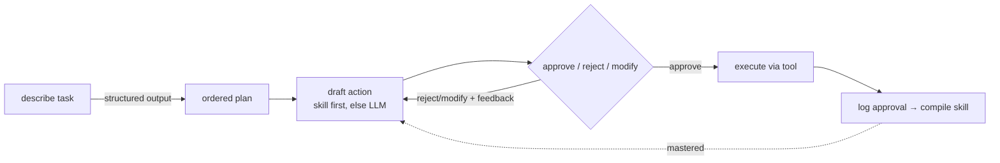
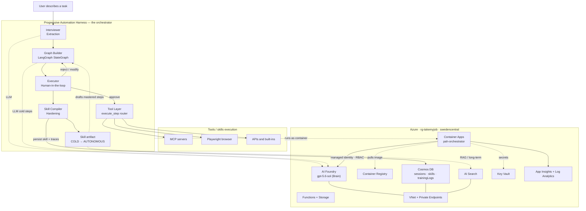
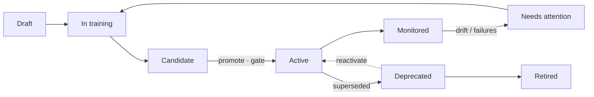

# Progressive Automation Harness

A working prototype that **interviews** you about a manual workflow, **grounds** it
into an ordered plan with an LLM, **executes** it with a human-in-the-loop, and
**compiles a reusable Skill** that progressively takes over the steps you keep
approving — until it can run them without you.

Built with Python 3.11+, [LangGraph](https://github.com/langchain-ai/langgraph)
and [LangChain](https://github.com/langchain-ai/langchain), a FastAPI + vanilla-JS
web app, an [MCP](https://modelcontextprotocol.io) tool layer, and Playwright for
web navigation. It runs fully offline for demos, live against **Azure AI Foundry**
(`gpt-5.6-sol`), and is **deployed to Azure** (Container Apps + Cosmos DB).

> This README is intentionally detailed. It documents both the *concept* (what a
> "harness" and a "skill" are) and the *solution* (every module, the tool layer,
> persistence, the web UI, and the Azure environment) with grounded facts.

---

## Table of contents

1. [The core idea: harness and skill](#1-the-core-idea-harness-and-skill)
2. [The maturity ladder](#2-the-maturity-ladder-how-a-skill-is-learned)
3. [The four-phase lifecycle](#3-the-four-phase-lifecycle)
4. [Codebase map (every module)](#4-codebase-map-every-module)
5. [The tool layer (MCP, Playwright, built-ins)](#5-the-tool-layer)
6. [Persistence (files vs Cosmos)](#6-persistence-files-vs-cosmos)
7. [The web UI](#7-the-web-ui)
8. [Running it](#8-running-it)
9. [The Azure harness environment](#9-the-azure-harness-environment)
10. [What this proves and why it matters](#10-what-this-proves-and-why-it-matters)
11. [Scope, honesty, and limitations](#11-scope-honesty-and-limitations)
12. [Enterprise enhancements delivered](#12-enterprise-enhancements-delivered)
13. [Skill portability: memory, tools, and actions](#13-skill-portability-memory-tools-and-actions)
14. [Skills-based vs. agentic architecture](#14-skills-based-vs-agentic-architecture)
15. [Cost model](#15-cost-model)
16. [The skill lifecycle](#16-the-skill-lifecycle)

---

## 1. The core idea: harness and skill

Two terms carry the whole design:

- **Harness** — the *scaffolding* that interviews you, runs an agent with human
  oversight, and harvests every approval as training signal. It is the temporary
  support structure around a task while a human is still needed. The word is
  literal: like a test harness or a climbing harness, it exists to hold something
  safely *until it can stand on its own*.

- **Skill** — the *learned, versioned artifact* the harness produces
  (`skills/<task>.json`). It captures, per workflow step, the human-approved
  actions (exemplars) and an earned **maturity level**. A skill is both the
  **dataset** (a labelled record of "good" actions) and the **compiled program**
  (it can draft the next action deterministically once mature).

The thesis in one sentence: **your approvals are training data, so supervising the
agent is the very act that makes your supervision unnecessary.** The harness is
what you remove; the skill is what remains.

---

## 2. The maturity ladder (how a skill is learned)

Each step of a workflow climbs a ladder as consistent, repeated human approvals
accumulate. Grading is based on how many times the *same* approved action repeats
(normalised for whitespace/case), computed in [skill.py](skill.py):

| Level | Trigger | Behaviour |
|-------|---------|-----------|
| `COLD` | no approvals yet | the LLM (or an offline mock) drafts fresh; you review every step |
| `PRIMED` | ≥ 1 approval | the LLM is primed with your approved examples (offline it replays the best one); you still review |
| `DETERMINISTIC` | same action approved ≥ 3× | the action is replayed verbatim; you only confirm |
| `AUTONOMOUS` | same action approved ≥ 5× | the executor stops asking and runs it automatically |

Thresholds are configurable in `skill.py` (`DEFAULT_THRESHOLDS`). A whole skill is
only as mature as its *weakest* step (`Skill.overall_maturity()`), so a new or
edge-case step keeps the human in the loop even after the rest is autonomous.

---

## 3. The four-phase lifecycle

```
interviewer.py  →  graph_builder.py  →  executor.py  →  skill_compiler.py → skill.py
  Extraction         Generation          Co-Pilot         Hardening          The Skill
```

1. **Extraction** — describe a task in plain words (or let the assistant
   interview you). The LLM, constrained by a Pydantic schema, emits a structured
   `WorkflowSchema`: task name, required inputs, and an ordered list of steps.
2. **Generation** — a LangGraph `StateGraph` is built dynamically from that
   schema with three nodes: `draft_action → human_review → execute_action`.
3. **Co-Pilot** — the graph runs, pausing before `human_review` at every step for
   your **Approve / Reject / Modify**. Reject/Modify feeds your feedback back into
   a redraft. Steps the skill has already mastered are auto-approved.
4. **Hardening** — approved steps are logged and compiled into the skill, whose
   per-step maturity climbs with each run.



### Solution and Azure architecture (detailed)

The harness (the orchestrator) drafts and executes steps, binds them to real
tools, and compiles a skill; it runs as a container on Azure and reaches the
Brain, memory, and secrets through managed identity over a private network.



---

## 4. Codebase map (every module)

| File | Role in the harness |
|------|---------------------|
| `interviewer.py` | **Extraction.** LLM acts as a Requirements Engineer, asks one question at a time, then forces a structured `WorkflowSchema` via `with_structured_output`. Also holds the offline demo schemas (`stock`, `expense`). |
| `models.py` | Pydantic `WorkflowSchema` / `WorkflowStep` (the contract) and the LangGraph `GraphState` `TypedDict` (the runtime state). |
| `graph_builder.py` | **Generation.** Builds the `StateGraph`. The `draft_action` node consults the learned skill first and only calls the LLM when the skill can't (yet) answer. `execute_action` calls the tool layer. |
| `executor.py` | **Co-Pilot.** Compiles the graph with `MemorySaver()` + `interrupt_before=["human_review"]`, drives the run, collects the decision, and **auto-approves autonomous steps**. |
| `skill.py` | **The output.** `Skill`, `StepStrategy`, the `Maturity` enum, the ladder logic, exemplar replay, and JSON persistence. No LangGraph/LangChain imports, so it is unit-testable in isolation. |
| `skill_compiler.py` | **Hardening.** Rebuilds a `Skill` from approved traces (`compile_from_records` works for both file and Cosmos backends). Idempotent: recompiling from the full log reproduces the same skill. |
| `llm_provider.py` | Chat-model factory. Azure AI Foundry (AAD, no keys) → OpenAI → offline fallback. Handles the `gpt-5.6-sol` constraints (token audience `https://ai.azure.com/.default`, temperature must be 1). |
| `tools.py` | The side-effecting tool layer (`execute_step`) and its resolver: structured tool-binding online, heuristic fallback offline, plus a real `resolve_ticker` name→ticker lookup and built-ins. |
| `tool_binding.py` | **Structured tool-binding.** Shows the model the tool catalog (MCP tools + built-ins) and gets an explicit `{tool, args}` decision, so arguments are typed, not parsed from prose. |
| `shell.py` | **Governed shell / script tool** (opt-in via `SHELL_TOOL_ENABLED`): allow-listed ad-hoc commands and prewritten `scripts/` invocation, deny-listed, sandboxed, time-boxed, human-gated. |
| `mcp_client.py` | Discovers and calls tools from MCP servers listed in `mcp_servers.json` over stdio; async calls run in a worker thread so they work inside FastAPI. |
| `mcp_demo_server.py` | A small MCP server (`get_stock_price`, `categorize_receipts`, `submit_expense_report`) that stands in for enterprise MCP servers. |
| `mcp_fabric_server.py` / `fabric_client.py` | A Fabric pipeline-builder MCP server that calls the **real Microsoft Fabric REST API** (managed identity) when `FABRIC_WORKSPACE_ID` is set, else a labelled simulation. |
| `embeddings.py`, `retrieval.py`, `telemetry.py`, `content_safety.py`, `distiller.py`, `monitoring.py`, `checkpointer.py`, `approvals.py`, `notifications.py` | The enterprise hardening layer (RAG grounding, semantic tool-binding, OpenTelemetry, Content Safety, prompt distillation, drift monitoring, Cosmos checkpointer, N-eyes approvals, Teams notifications). See [§12](#12-enterprise-enhancements-delivered). |
| `store.py` | Persistence abstraction: `FileStore` (local `skills/` + `dspy_training_logs.jsonl`) or `CosmosStore` (Azure Cosmos DB via managed identity), selected by `COSMOS_ENDPOINT`. |
| `server.py` | FastAPI backend that wraps the whole harness for the browser (see [§7](#7-the-web-ui)) and the deployed container. |
| `main.py` | CLI orchestrator: `--simulate N`, `--auto`, `--show-skill`, `--task {stock,expense}`, plus the approval-logging and maturity report. |
| `web/` | The single-page app: **Studio**, **Library**, and **Debrief** tabs, plus the "Watch it run" skill runner (`index.html`, `styles.css`, `app.js`). |
| `tests/test_harness.py` | 39 unit tests (skill ladder, compiler idempotence, tool routing, structured binding, ticker resolver, governance, N-eyes). |
| `infra/` | Bicep IaC (`main.bicep`, `main.bicepparam`) and deploy scripts (`deploy.py`, `acr_build.py`). |

---

## 5. The tool layer

`execute_step(step, action, inputs, model)` in `tools.py` binds an approved action
to a real capability. When a live model is available it uses **structured
tool-binding**; offline it falls back to a heuristic resolver.

1. **Governed shell / scripts** (opt-in via `SHELL_TOOL_ENABLED`, off in the cloud
   deployment) — run an allow-listed ad-hoc command or a prewritten
   `scripts/*.ps1|py|sh` with typed flags. Deny-listed, operator-free, sandboxed
   to the repo, time-boxed, and always human-gated (`shell.py`).
2. **Structured tool-binding** (`tool_binding.py`) — the model is shown the tool
   catalog (discovered MCP tools + built-ins) and emits an explicit
   `{tool, args}` decision, resolving entities itself (e.g. a company name → its
   ticker) and returning `none` for pure reasoning / presentation steps. No
   argument guessing, so new workflows don't need per-domain parsing code.
3. **Heuristic fallback (offline)** — MCP match by embeddings/token score →
   Playwright web browse → built-ins (a live stock quote backed by a real
   name→ticker lookup, `resolve_ticker`). An unbound step returns an honest
   `[manual]` result rather than faking success, so a human still owns it.

Every drafted action is screened by **Azure AI Content Safety** before any side
effect, and high-risk steps stay human-gated. This layered design is the seam
where a production system plugs in MCP servers, REST/GraphQL/SDK connectors, RPA,
or a human fallback — registering an MCP tool adds it to the catalog
automatically.

---

## 6. Persistence (files vs Cosmos)

`store.py` exposes one interface with two backends, chosen at runtime:

- **`FileStore`** (default, local dev) — the existing `skills/*.json` files and the
  append-only `dspy_training_logs.jsonl`. Behaviour is unchanged when Cosmos isn't
  configured, so local runs and tests are unaffected.
- **`CosmosStore`** (in Azure) — the `harness` Cosmos database, using AAD via the
  managed identity. Skills live in the `skills` container, approved traces in
  `trainingLogs`. Selected automatically when the `COSMOS_ENDPOINT` env var is set.

The training log is named `dspy_training_logs.jsonl` because it is intended as the
dataset for a *future* [DSPy](https://github.com/stanfordnlp/dspy) compilation step.
Today, deterministic hardening is done by `skill_compiler` via exemplar
aggregation — a real, working stand-in, not DSPy itself.

---

## 7. The web UI

`python server.py` serves a single-page app at `http://127.0.0.1:8000` with three
tabs:

- **Studio** — the working surface: **1 · Define the workflow** (describe a task in
  plain language), **2 · Co-Pilot** (the step-by-step human-in-the-loop timeline
  with Approve / Reject / Modify / Edit and a tool badge per execution), and
  **3 · The Skill** (the maturity ladder, per-step progress, and JSON / Prompt /
  Export / Deploy / **Run deployed skill** actions).
- **Library** — browse every compiled skill as a card (maturity, steps,
  approvals). **Open in Studio** to inspect it, or **▶ Watch it run** to execute a
  deployed skill and watch each step reveal live (source badge, tool, result,
  status), with a hand-off to the co-pilot at any high-risk step. A skill's
  declared inputs render as labelled fields.
- **Debrief** — a self-contained explainer of the concept, the Azure
  architecture, the enterprise value, and what the prototype proves.

Key backend endpoints: `/api/health`, `/api/generate`, `/api/interview/*`,
`/api/session*`, `/api/simulate`, `/api/models`, `/api/mcp/tools`, `/api/skills`,
`/api/skill-report`, `/api/skill-artifact`, `/api/skill-export`,
`/api/skill-deploy`, `/api/skill-run` (structured per-step results),
`/api/knowledge/*`, `/api/governance/screen`, `/api/fabric/selftest`,
`/api/shell/*`, `/api/scripts`.

---

## 8. Running it

### Offline (no cloud, no key)

```powershell
cd progressive-automation-harness
pip install -r requirements.txt

# Watch a skill graduate to autonomy over 6 auto-approved runs:
python main.py --simulate 6 --task stock

# Inspect the learned skill artifact:
python main.py --show-skill --task stock
```

### Web UI

```powershell
python server.py            # then open http://127.0.0.1:8000
```

### Tests

```powershell
pytest -q tests/test_harness.py      # 39 tests
```

### Live mode (Azure AI Foundry)

`.env` points at the Foundry project; auth is Azure AD (no keys) via the
Windows/VS Code broker (`azure-identity-broker`) using your signed-in account —
no `az login` required.

```
AZURE_AI_ENDPOINT=https://takemyjob.services.ai.azure.com/api/projects/proj-default/openai/v1
AZURE_AI_DEPLOYMENT=gpt-5.6-sol
```

Playwright browsing needs its browser once: `playwright install chromium`.

---

## 9. The Azure harness environment

The prototype is deployed into resource group **`rg-takemyjob`**
(subscription `ME-MngEnvMCAP999938-kimyo-1`, region **swedencentral**). It maps
onto a standard enterprise AI reference architecture.

**Reused (already existed):** AI Services account `takemyjob` + project
`proj-default` + model `gpt-5.6-sol` (the *Brain*); Application Insights
`airgtakemyjob03b5ad` (*Observability*); Key Vault `kvrgtakemyjob03b5ad` (*secrets*).

**Provisioned by the IaC** (`infra/main.bicep`):

| Architecture layer | Azure resource(s) |
|--------------------|-------------------|
| Orchestration | Azure Container Apps environment (VNet-integrated) + the `pah-orchestrator` app that runs this harness |
| Tools / skills | Azure Functions (consumption) + Storage; plus the in-app MCP + Playwright tool layer |
| Memory | Azure Cosmos DB (serverless): `sessions`, `skills`, `trainingLogs` containers; Azure AI Search (Basic) for long-term / RAG memory |
| Identity & governance | one user-assigned managed identity with least-privilege RBAC; Content Safety via the AI Services account; API Management is optional (off by default) |
| Networking | a VNet with **private endpoints** for AI Services, Cosmos, and Search, plus private DNS zones |
| Registry | Azure Container Registry (`pahacrqzbtlziciba4a.azurecr.io`) holding the orchestrator image |
| Observability | the existing Application Insights + a Log Analytics workspace |

**Security posture:** authentication is **managed identity + Azure AD RBAC**, not
keys. Cosmos and AI Search have local (key) auth **disabled**. The managed
identity holds only the roles it needs (Cognitive Services User, Key Vault Secrets
User, Cosmos data contributor, Search Index Data/Service Contributor, Storage
Blob/Queue data roles, AcrPull).

**How it was deployed:** Bicep is compiled to ARM and submitted via the Azure
management REST API using the signed-in broker token (`infra/deploy.py`) — no
`az` CLI. The container image is built **in the cloud with ACR Tasks**
(`infra/acr_build.py`), because local Docker was unavailable (hardware
virtualization was not enabled). No local Docker daemon is required.

**Verified live** at
`https://pah-orchestrator.braveforest-e1e276d5.swedencentral.azurecontainerapps.io`:
`/api/health` returns `{"ok":true,"offline":false}`, and a full cloud session
generated a plan with `gpt-5.6-sol`, executed a real Yahoo Finance quote through
an MCP tool (`[mcp:harness-demo/get_stock_price] MSFT is trading at 513.53 USD`),
and **persisted the learned skill to Cosmos DB** (read back successfully).

`lockDownPublicAccess` is now `true`: Cosmos and AI Search accept traffic only
over their private endpoints, and the VNet-integrated orchestrator reaches them
that way (verified). Local development uses the file store, so it is unaffected.
AI Services keeps public access so the harness can also run live from a developer
machine; ACR stays public because Basic cannot host a private endpoint (Premium can).

---

## 10. What this proves and why it matters

**What the prototype proves (grounded in the working system):**

- A manual task described in one sentence can be **grounded by an LLM into an
  ordered, executable plan** (the Extraction phase, verified live).
- That plan can be **executed with a human-in-the-loop** where each action is
  approved, rejected, or modified, and rejections steer a redraft.
- **Human approvals become durable training data**, and repeated approvals
  **provably move a step up a maturity ladder** until the system auto-approves it
  (demonstrated by the Simulate flow graduating a skill to `AUTONOMOUS`).
- The same app runs **offline (mocks), live (Azure AI Foundry), and deployed
  (Container Apps + Cosmos)** without code changes — only configuration.
- Steps can bind to **real capabilities** (MCP tools, live web/Playwright,
  external APIs) rather than being purely conversational.

**Why an enterprise could use something like this to accelerate its AI journey:**

- **It starts where the work already is.** Instead of a big up-front automation
  project, an employee describes a task they already do; the system automates it
  incrementally as trust is earned. Adoption is bottom-up and low-risk.
- **It keeps humans in control by default.** Nothing runs unattended until it has
  been approved consistently, and any step can be pinned to always require a human.
  That is the governance posture regulated enterprises need.
- **It captures tacit knowledge.** The skill artifact is a portable, auditable
  record of *how* a task is done — valuable for continuity, onboarding, and
  compliance, independent of the individual.
- **It rides managed, governed infrastructure.** The deployment uses managed
  identity, RBAC, private networking, Key Vault, and Application Insights — the
  same controls an enterprise already mandates — so the path from prototype to
  production is a hardening exercise, not a rewrite.
- **It is orchestrator-agnostic.** The same Reason → Act → Observe loop can be
  implemented with LangGraph (as here) or Semantic Kernel / Azure AI Agent
  Service; the harness idea and the skill artifact are the durable parts.

**Why it is important:** most enterprise value is locked in thousands of small,
undocumented, repetitive workflows that are individually too minor to justify a
classic automation project. A progressive, human-supervised harness lets an
organisation automate that long tail safely, one approval at a time, while
producing an auditable trail of exactly what was automated and why.

---

## 11. Scope, honesty, and limitations

This is a **prototype**. To avoid over-claiming:

- The **target finance/ERP system is simulated** (`submit_expense_report` is a
  labelled stand-in — there is nothing real to submit to). The stock quote, web
  browsing (Playwright), and receipt categorization are real.
- Unbound steps return an honest "manual step, no tool bound" result instead of
  faking success.
- **Deterministic hardening is a real exemplar-based compiler** (replays the
  dominant approved action). DSPy is an optional future optimiser, not a gap.
- **Autonomy is risk-gated**: steps flagged `human_required` (or matching
  high-risk verbs) always need a human, and any step a human rejects or whose
  execution fails is capped below autonomous ("demote-on-reject/failure").
  Tool-to-step binding uses **embeddings** (semantic match), falling back to
  keyword scoring.
- **Session state** (`_SESSIONS`) is in-memory per instance, but the LangGraph
  checkpointer is **Cosmos-backed**, so a paused human-in-the-loop run survives a
  restart; skills and traces also persist to Cosmos.
- The **Cosmos and AI Search data layer is private** (`lockDownPublicAccess=true`);
  the VNet-integrated orchestrator reaches it over private endpoints.

Together these keep the demo honest: the *mechanism* (interview → ground → supervise
→ harden into a portable skill, on governed Azure infrastructure) is real and
verified. See [§12](#12-enterprise-enhancements-delivered) for the full list of
enterprise hardening that has since been built; the one remaining mock is real
target-system (finance/ERP) connectors.


---

## 12. Enterprise enhancements delivered

The prototype has been hardened into an enterprise-grade reference solution.
**Twelve of the thirteen** planned enhancements are built, deployed, and covered
by tests; the one exception (#5, real finance/ERP connectors) is intentionally
left mocked so the demo makes no false claims about touching production systems.

| # | Capability | What it adds | Status |
|---|------------|--------------|--------|
| 1 | Runtime inputs / parameterization | A skill learned on one input (MSFT) generalizes to others (AAPL) via templated exemplars. | Done |
| 2 | Execution verification | Captures success / failure / blocked per step and demotes autonomy on failure, not just rejection. | Done |
| 3 | Authentication | Microsoft Entra ID (Easy Auth) fronts the app; unauthenticated requests are redirected to sign-in. | Done |
| 4 | Durable checkpointer | Cosmos-backed LangGraph checkpointer so paused HITL sessions survive restarts and scale-out. | Done |
| 5 | Real target-system connectors | Live finance / ERP integrations via Logic Apps or MCP. | Deferred (mocked) |
| 6 | RAG grounding | Azure AI Search vector index grounds each drafted step in your own SOPs and policies. | Done |
| 7 | Embeddings tool-binding | Steps bind to the semantically closest tool by embeddings, not fragile keyword matching. | Done |
| 8 | Distributed tracing | OpenTelemetry spans to Application Insights for every request and per-step draft / execute. | Done |
| 9 | Content Safety gate | Every action is screened before execution; unsafe actions are blocked and handed to a human. | Done |
| 10 | API Management token limits | Rate limit, weekly quota, and an LLM token-per-minute policy on the governance gateway. | Done |
| 11 | Approval policy | Risk-gated autonomy: high-consequence steps always need a human; rejected/failed steps can never auto-run; high-risk steps can require **N distinct approvers** (segregation of duties) with optional Teams notification. | Done |
| 12 | Prompt distillation | Approved exemplars are compiled into one optimized per-step instruction for the portable prompt. | Done |
| 13 | Drift monitoring | Compares recent vs. baseline failure / rejection rates and flags a degrading skill. | Done |

**Plus operations:** in-loop **step editing** (edit an action and run it; the edit
becomes the learned exemplar); **N-eyes approvals** (a high-risk step can require
several *distinct* approvers, with an out-of-band **Microsoft Teams** notification
via an incoming webhook); a **Fabric pipeline-builder** skill (create lakehouse,
create pipeline, add copy activity, create dataflow, run, validate) that binds to
a simulated Fabric MCP server locally and to the **real Microsoft Fabric REST
API** (via the container's managed identity) when `FABRIC_WORKSPACE_ID` is set;
and a **GitHub Actions CI/CD** pipeline
(`.github/workflows/deploy.yml`: test, build in ACR, roll out to Container Apps
via OIDC).

> **Fabric is live end-to-end (verified).** Against a real workspace on an F4
> capacity, the harness built a Lakehouse and a Data pipeline with a Copy
> activity (public CSV → Lakehouse table); the run **Completed** and the `iris`
> Delta table landed in the lakehouse. The identity path is: workspace assigned
> to the capacity, the container's managed identity granted **Contributor** on
> the workspace, and the tenant setting *“Service principals can call Fabric
> public APIs”* enabled.

New modules: `embeddings.py`, `retrieval.py` (#6/#7), `telemetry.py` (#8),
`content_safety.py` (#9/#11), `distiller.py` (#12), `monitoring.py` (#13),
`checkpointer.py` (#4), `approvals.py` + `notifications.py` (N-eyes + Teams),
`mcp_fabric_server.py` (Fabric demo). New infra scripts: `infra/setup_auth.py`
(#3), `infra/deploy_embeddings.py`.

**Interface & tooling (latest):** a **Skills Library** to browse every compiled
skill; a **"Watch it run"** runner that executes a deployed skill and reveals each
step live (source, tool, result, status) with a co-pilot hand-off at any
high-risk step; a **governed shell / script tool** (`shell.py`, opt-in and off in
the cloud deployment); and **structured tool-binding** (`tool_binding.py`) plus a
real name→ticker `resolve_ticker`, so the model chooses tools and typed arguments
from a catalog — new workflows no longer require per-domain argument-parsing code.

Optional/future (not built): skill versioning diff/rollback, a fleet dashboard of
skills and hours saved, and ACR Premium.

---

## 13. Skill portability: memory, tools, and actions

A recurring question is what a skill can actually *do* inside the harness versus
what happens when you hand it to someone else. The design draws a deliberate line:
**the skill is portable knowledge; the ability to act stays server-side.**

### Deployed *inside* the harness — full agent

When a skill is deployed in the harness (`/api/skill-deploy`, then run in a
co-pilot session or headlessly via `/api/skill-run`), it has:

- **Memory** — three layers. *Semantic/procedural:* the skill artifact itself
  (per-step exemplars, maturity, distilled instructions, required inputs) in
  Cosmos. *Episodic/runtime:* the Cosmos-backed LangGraph checkpointer, so a
  paused run resumes after a restart. *Long-term/knowledge:* RAG grounding from
  Azure AI Search injected into drafting.
- **Tools** — full access to the tool layer via `execute_step`: MCP servers,
  Playwright browsing, and built-ins, bound to each step by embeddings.
- **Actions** — yes, it performs real side effects, but **governed**: every
  action is screened by Content Safety first, high-risk steps always require a
  human, and headless runs stop at the first high-risk step.

So inside the harness a deployed skill is a full, governed agent with memory,
tools, and the ability to act.

### Shared *outside* the harness — portable know-how only

When you export a skill (the JSON artifact, or the model-agnostic prompt from the
**Prompt** button / `/api/skill-export`) and hand it to another LLM or system:

- **Memory** — only its *semantic* memory travels: the learned per-step
  instructions, exemplars, maturity, and required inputs. The *episodic* session
  state (checkpointer) and the *RAG knowledge index* stay in your Azure tenant and
  do **not** travel. The recipient gets the know-how, not your live grounding data.
- **Tools** — **none**. The artifact has zero binding to MCP servers, Playwright,
  or any tool; those bindings live in the harness (`tools.py`), not in the skill.
  A receiving model can *reason about* the steps but cannot call your systems.
- **Actions** — **none by itself**. A shared skill is a recipe, not an agent. To
  make it act, the receiving host must supply its *own* execution layer,
  credentials, and guardrails.

This is a feature, not a limitation: **no credentials, no tool access, and no
side-effecting power travel with a shared skill.** You can safely share the
learned procedure across teams or models; the authority to act (tools + identity +
governance) remains inside the harness you control.

---

## 14. Skills-based vs. agentic architecture

A natural question: everyone talks about *"building an agent,"* but this builds a
**skill** and has the LLM work *with* skills. Are they different? The honest answer:

> **This *is* an agentic system — but its *product* is a skill, not an agent.** The
> harness runs a textbook reason → act → observe loop (LangGraph, tools, HITL). The
> difference is that it treats that agent as a **factory that distills itself into
> durable, deterministic skills**, rather than treating the agent as the deliverable.

So it isn't "skill vs. agent" as rivals — it's **where the intelligence ends up
living**: invoked fresh from the model on every run, or progressively extracted
into a reusable, governed asset.

| Dimension | Classic "agentic" solution | This skills-based harness |
|-----------|----------------------------|---------------------------|
| Where intelligence lives | In the model + prompt, invoked *fresh every run* | Progressively *extracted* into a compiled artifact; the LLM is only called for cold/novel steps |
| Determinism | Non-deterministic; same input can take different paths | Mastered steps replay **byte-for-byte**, auditable |
| How it improves | Change the prompt / model / fine-tune | Human **approvals** provably graduate steps up a maturity ladder — supervised and measurable |
| Human role | Trust assumed up front; review after, or guardrails only | Human in the loop **by default**; supervision *decreases as trust is earned*, per step, risk-gated |
| Cost / latency | ~Constant LLM cost **forever** | **Decays toward zero** as skills mature |
| Portability | Bound to its framework / model / runtime | A model-agnostic artifact any LLM can replay or prime on |
| Drift | Silent when the model updates | Explicit drift monitoring + demote-on-failure pulls a step back under supervision |

**The mental model.** A pure agent is a brilliant contractor you re-hire and
re-brief for *every* job — powerful, but variable, expensive per call, and you must
trust them each time. A skills-based harness is: you supervise that contractor a
few times, it *writes down the vetted procedure*, and after enough consistent runs
**the procedure runs itself** — the contractor (LLM) is only called back for
genuinely new situations. Agentic architecture is *"intelligence as a service, per
call"*; the skill approach is *"intelligence amortized into a reusable asset."*

**Where it sits between the classic paradigms:**

- vs **RPA** (deterministic but brittle, hand-authored, no learning): like RPA that
  *writes itself* through supervised LLM runs.
- vs **fine-tuning / distillation**: skill compilation *is* a lightweight, per-step,
  human-supervised distillation — but it produces an inspectable, editable artifact,
  not opaque weights.
- vs **agent memory** (many "agents" bolt on a vector store of past runs as *hints*):
  here those traces become a **graded, executable program**, not just retrieval.

The LLM works *with* the skills to drive the solution rather than *being* the
solution. The agent is the means; the skill — auditable, deterministic, portable,
and progressively autonomous — is the durable end. That is also why the cost
decays: you are not renting intelligence on every execution, you are manufacturing
an asset that needs the model less and less over time.

---

## 15. Cost model

Approximate **list prices** (swedencentral) to size the decision; confirm exact
figures in the Azure Pricing Calculator or your agreement. The shape matters more
than the exact dollars: a **fixed platform floor** plus **usage that decays as
skills mature**.

### Baseline (paid even at zero traffic)

| Component | ~$/mo | Note |
|-----------|-------|------|
| Azure AI Search (Basic) | 75 | Biggest idle cost; enables RAG |
| API Management (Developer) | 48 | Governance gateway; dev/test tier |
| Private endpoints (×3) + private DNS | ~25 | Network isolation for data layer |
| Container Registry (Basic) | 5 | Image storage |
| Log Analytics / App Insights | 5–15 | Per-GB ingested |
| Storage + Key Vault + Cosmos storage | ~5 | Tiny at this scale |
| Container Apps / Functions / Cosmos (idle) | ~0 | Scale-to-zero |
| Managed identity, VNet, Entra Easy Auth | 0 | Free |
| **Baseline floor** | **~$165–180** | ~75% is AI Search + APIM |

Strip it to **~$50–70/mo** by setting `deployApim=false` and using AI Search Free.

### Usage (what drives incremental cost)

| Trigger | Meter | Behaviour |
|---------|-------|-----------|
| Runs with *immature* steps | Foundry model tokens | The main variable; mastered steps replay with **no LLM call** |
| Browsing / long steps | Container Apps vCPU-s + GiB-s | Playwright/multi-step keep a replica warm |
| RAG + embeddings tool-binding | `text-embedding-3-small` (~$0.02/1M) | A few embeddings per step; ~free |
| Action screening | Content Safety (~$0.75/1,000; small free tier) | One call per executed action |
| Persistence | Cosmos RUs (~$0.25/1M) | Reads/writes of skills, traces, checkpoints |
| Fabric / target actions | Fabric capacity (e.g. F2/F4/F64) | Only if you run real Fabric pipelines |
| Observability | Log Analytics (~$2.76/GB) | Scales with tracing verbosity |
| Image rebuilds | ACR Tasks minutes | Only on deploy |

### The decay dynamic

A `COLD` step calls the model every run; once it reaches
`DETERMINISTIC`/`AUTONOMOUS` it **replays the approved action with no LLM call**,
so per-run cost collapses to container compute + a few Cosmos RUs (fractions of a
cent). Early runs pay for learning; later runs are nearly free. Model selection
reinforces this: `Auto` tiers cheap/fast models (e.g. `gpt-5.4-nano`) to simple
work and stronger models to complex drafting.

**Rule of thumb:** budget a **~$165–180/mo platform floor** (or ~$50 stripped
down) **plus token usage that is highest during learning and trends toward
near-zero as skills graduate** — the opposite of a naive agent that pays full
token cost on every execution forever. Multi-model deployments themselves add
**~$0 idle** (GlobalStandard is pay-per-token).

---

## 16. The skill lifecycle

A skill is a **governed asset**, so it has a managed lifecycle layered on top of
the maturity ladder. Two dimensions run in parallel:

- **Maturity** (learning) — `COLD → PRIMED → DETERMINISTIC → AUTONOMOUS` (see
  [§2](#2-the-maturity-ladder-how-a-skill-is-learned)): how much the skill does on
  its own.
- **Lifecycle status** (governance) — how the skill is *managed*:
  `draft → in training → candidate → active → (needs attention) → deprecated →
  retired`.



**Publish gate.** Promotion to *active* requires the skill to reach
`DETERMINISTIC` **and** carry no rejected or failed steps (`Skill.is_promotable()`
in [skill.py](skill.py)). The gate is surfaced as a checklist in the UI.

**Versioning + rollback.** Every publish snapshots the skill
(`Skill.snapshot()`); the version history is kept on the artifact and you can
**roll back** to any prior version (`Skill.restore()`). Lifecycle metadata
(status, owner, versions, publish state) is preserved across recompilation
(`store.compile_and_save`).

**Drift-driven supervision.** A live skill whose recent failure / rejection rate
climbs (`monitoring.drift_report`) is shown as **needs attention** and stays under
human supervision until it recovers — closing the loop back to training.

**Manage it in the UI.** Each card in the **Library** shows a lifecycle status
badge; its **⛭ Lifecycle** panel shows the stage timeline, the publish-gate
checklist, drift, the version history (with **Rollback**), and actions:
**Promote / Certify / Deprecate / Retire / Reactivate**.

**Quality evaluation (Validate).** Beyond the binary gate, each skill gets a
five-dimension scorecard ([evaluation.py](evaluation.py), SkillNet-inspired):
**Safety, Completeness, Executability, Maintainability, Cost-awareness** — each
0-100, derived from recorded signals (approvals, failures, rejections, maturity,
distilled instructions, execution traces), plus an overall grade (A-D). Promotion
is gated on the overall score clearing a floor (`EVAL_PROMOTE_FLOOR`, default 55),
so publishing means *measurably* good, not just mature.

**Discovery.** The Library has **search + status filter**, and each Lifecycle
panel lists **related skills** by embedding similarity of their summaries
(`similar_to`).

Endpoints: `GET /api/skill-lifecycle?name=`, `POST /api/skill-lifecycle?name=`
(`{action}`), `POST /api/skill-rollback?name=` (`{version}`),
`GET /api/skill-evaluate?name=`, `GET /api/skill-similar?name=`,
`POST /api/skills/seed` (demo skills spanning lifecycle states).
